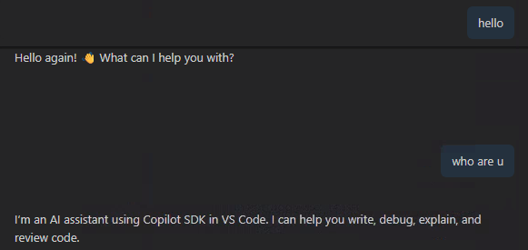
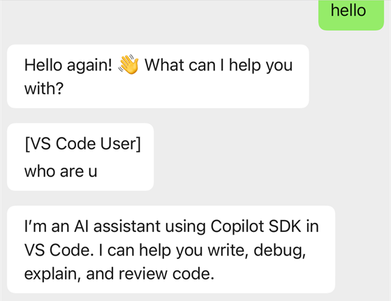
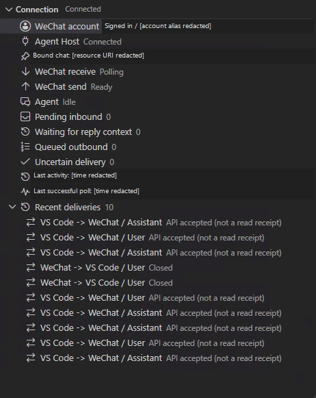

# WeChat AHP

**Continue an existing VS Code agent conversation from WeChat.**

WeChat AHP connects your WeChat direct messages to an explicitly selected local
Agent Host chat. Send a message from your phone, continue in VS Code, and receive
the agent's completed text replies in WeChat. Both interfaces use the same
conversation, not a second model or a copied chat history.

> **Preview: Windows, macOS, and Linux desktop.** You need a running, compatible local
> Agent Host with an existing session. Not every VS Code chat exposes AHP, and
> installing this extension does not create or authenticate an agent provider.

## Features

- **Two-way text sync:** WeChat messages arrive in VS Code unchanged. New VS Code
  user messages and completed agent replies are sent to your authorized WeChat account.
- **Clear message sources:** Messages typed in VS Code are labeled
  `[VS Code User]` in WeChat. Agent replies have no added label.
- **Native session browser:** Explore local **Host > Session > Chat** resources,
  inspect their details, and bind the exact chat you want.
- **Connection dashboard:** See account, Agent Host, incoming/outgoing message
  status, pending messages, uncertain deliveries, and recent activity.
- **QR sign-in:** Sign in from VS Code without putting credentials in settings.
- **No additional model API key:** The selected Agent Host continues to use its
  existing provider, authentication, and model.

## See it in action

**The existing conversation in VS Code**



**The same conversation in WeChat**



The WeChat view includes `[VS Code User]` on messages typed in the editor.
These screenshots retain the original example text; model controls, the phone
status bar, timestamps, and unrelated conversation have been cropped out.

### Connection dashboard



*Cropped Connection view. Account identifiers, the chat URI, and timestamps are
redacted. "API accepted" is not a read receipt.*

## Requirements

- Native desktop VS Code **1.110 or later** on Windows, macOS, or Linux, using
  the local UI extension host. The same universal extension package is used on
  all three systems; the runtime contains no platform-specific native add-ons.
- A running **local Agent Host** that supports the Agent Host Protocol (AHP),
  exposes an existing session/chat and its working directories, and supports
  user turns, queued messages, and completed text response events.
- The agent's working directories must be inside the local workspace folders
  that you have explicitly trusted in VS Code.
- A WeChat account that can complete the Weixin bot QR sign-in flow. Account
  eligibility and service availability depend on Weixin.
- A working OS credential store for VS Code SecretStorage. On macOS, unlock
  Keychain; on Linux, ensure your desktop keyring is available and unlocked.
  The extension does not fall back to plaintext credential files.

The extension bundles its runtime dependencies. You do not need Node.js or a
separate channel CLI to use it. Your agent provider's own setup, subscription,
permissions, and usage charges still apply.

### Local Agent Host discovery

Local discovery checks the standard VS Code and VS Code Insiders data folders:

| Platform | Stable VS Code data directory |
|---|---|
| Windows | `%APPDATA%\Code` |
| macOS | `~/Library/Application Support/Code` |
| Linux | `$XDG_CONFIG_HOME/Code`, or `~/.config/Code` when unset |

The corresponding `Code - Insiders` directory is also checked. The Host must
publish an endpoint under `agent-host/local-endpoint/entries`. Loopback TCP,
Windows named pipes, and user-owned Unix-domain sockets are supported. Custom
`--user-data-dir` locations are not automatically searched.

## Install

Open **Extensions** in VS Code, search for **WeChat AHP** by **formulahendry**, and
select **Install**.

[View on Visual Studio Marketplace](https://marketplace.visualstudio.com/items?itemName=formulahendry.wechat-ahp)

[View on Open VSX](https://open-vsx.org/extension/formulahendry/wechat-ahp)

Open VSX is an alternative distribution channel. The same local Agent Host
requirements apply; availability in a registry does not mean every editor
supports AHP.

## Get started

1. Open the local folder used by your existing agent session and trust it in VS Code.
2. Open **WeChat AHP** in the Activity Bar.
3. In **Connection**, select **Sign in with QR**. Scan with your own WeChat account
   and confirm on your phone. Closing the QR panel cancels sign-in.
4. In **Sessions**, expand a **Host**, then a **Session**, and choose a **Chat**.
   Use **Bind Chat** to save the selection, or **Bind and Connect** to continue.
   Check the exact host and chat when titles are similar.
5. Confirm **Connect**. The confirmation explains that new user messages and
   completed agent text from this chat will automatically be sent to WeChat.
6. Send the bot a fresh WeChat message, such as `Hi from WeChat`. This also
   establishes the private reply context needed for outgoing messages.
7. Continue in either WeChat or the same VS Code chat. Use **Disconnect** when finished.

The extension does not connect automatically after VS Code restarts.

You can also find all primary actions in the Command Palette under **WeChat AHP**.
The status bar opens the extension's sidebar.

## What gets synchronized?

| Source | Result |
|---|---|
| A new authorized WeChat direct message | The original text becomes a user message in the bound VS Code chat. |
| A new user message typed in the bound VS Code chat | Sent to WeChat with a `[VS Code User]` label. |
| The agent completes a tracked turn | Its visible Markdown text is sent to WeChat after the turn completes. |
| A chat is already busy | WeChat text is queued without cancelling the running turn. |
| No WeChat reply context is available yet | Outgoing text waits until the authorized owner sends a WeChat message. |

For example, typing `hello from VS Code` produces:

```text
[VS Code User]
hello from VS Code
```

The agent's answer is sent separately, without this prefix.

**Not synchronized:** existing history, other chats, reasoning, tool input/output,
attachments, drafts, system/automation messages, edits/deletions of old messages,
or partial replies from cancelled or failed turns. The extension sends completed
visible Markdown, not individual streaming tokens. AHP does not separately label
visible progress prose and the final paragraph within that Markdown.

Long text is split on Unicode code-point boundaries. VS Code user messages keep a
source label on each part, for example `[VS Code User 1/3]`.

## Browse sessions and monitor the connection

**Sessions** loads metadata as you expand the tree. It does not start WeChat sync
or subscribe to every chat's transcript.

| Action | Purpose |
|---|---|
| **Refresh Local Hosts** | Discover currently running local Agent Hosts. |
| **Check AHP Connection** | Perform a protocol-level ping without starting sync. |
| **Load More Sessions** | Load the next page of a Host's session catalog. |
| **View AHP Details** / **Copy Resource URI** | Inspect the exact resource without changing it. |
| **Reveal Bound Chat** | Locate the current binding in the tree. |
| **Bind Chat** / **Bind and Connect** | Explicitly select an eligible existing chat. |

**Connection** separates Agent Host connectivity, WeChat polling, outgoing
delivery, and agent activity. An agent can be **Busy** or **Awaiting input** while
the channel itself is healthy. **Waiting for a WeChat message** means reply
context is missing, not that the Agent Host is disconnected.

Recent deliveries show metadata only. **API accepted** means the service accepted
the request; it does not mean the recipient read the message.

Hiding the sidebar does not stop sync. **Disconnect** stops this extension's
channel, not the agent's ongoing work.

## Privacy and control

- Only the owner identified by QR confirmation can send messages through the
  channel. Other senders, group messages, and non-text content are rejected.
- You explicitly approve a binding to one existing chat. Selecting or expanding
  a tree row never changes that binding.
- Bot credentials, message cursors, private reply contexts, and the delivery
  journal use VS Code **SecretStorage**. Credentials are not stored in workspace
  settings or displayed in tree nodes and diagnostics.
- Tool approvals stay in VS Code. WeChat text cannot approve tools or change
  the host's permission policy.
- Only new text in the bound chat is mirrored. Do not enter text there that you
  do not want sent to WeChat. Known transport credentials are blocked, but this
  extension is **not a general data-loss-prevention system**.
- The extension does not add analytics or telemetry collection. Your selected
  agent provider and Weixin have their own data-processing policies.
- At most one instance of this extension can own the local channel for an OS
  user at a time, including across windows and profiles.

The local ownership lock uses a Windows named pipe or a per-user loopback TCP
lease on macOS/Linux. The latter listens only on `127.0.0.1`, immediately closes
connections, and transfers no messages or credentials. The OS releases the lock
when the process exits; a paused debugger does not lose ownership because of a
heartbeat timeout. A port collision fails closed rather than selecting another
port. This local lock does not coordinate different computers: do not connect
the same bot from multiple machines at once.

Before sharing diagnostics or screenshots, review session URIs, account aliases,
workspace paths, chat text, and other applications' UI. Encoded identifiers are
not anonymized merely because they are not readable at a glance.

## Delivery and recovery

WeChat AHP records incoming messages before advancing the polling cursor and
records outgoing send intent before contacting Weixin. It retries eligible
connection and polling failures with bounded backoff.

It **does not promise exactly-once delivery**. If a send is interrupted, a message
may already have reached WeChat. Such deliveries are marked **uncertain** and are
not automatically resent.

During automatic reconnect, the extension can recover completed responses for
turns it already tracked. It does not backfill new editor messages that appeared
while disconnected. A new manual connection does not replay the previous run's
unfinished outgoing queue.

Use **Clear Pending Journal (No Resend)** only after inspecting the original chat
and WeChat. It closes pending local routes without resending or cancelling host
turns, preserves uncertain-send evidence, and requires a fresh WeChat message to
establish reply context again.

**Sign out and Clear Channel State** removes this extension's local account,
binding, and journal. It does not claim to revoke credentials on the server, and
forgetting the journal also removes local deduplication evidence.

## Troubleshooting

| Symptom | What to do |
|---|---|
| No local Agent Host appears | Open a compatible AHP-backed session first. An ordinary chat window may not expose AHP. |
| The bound Host is unavailable | Refresh **Sessions**. A restarted Host may have a new identity; explicitly select the correct chat again. |
| A chat is unavailable in this workspace | Open and trust its actual local working folders. The Host must expose working-directory metadata. |
| Another window owns the channel | Disconnect or close that channel instance first. Do not run another poller for the same bot. |
| Local owner lock port is occupied | On macOS/Linux, stop another instance first. If none is running, another local application may occupy the reported loopback port; the extension will not bypass the lock. |
| SecretStorage is unavailable | Unlock or restore the OS credential store, then retry. Do not move credentials into settings or plaintext files. |
| WeChat send is waiting | Send a new direct message from the QR-confirmed owner to establish reply context. |
| Weixin authorization fails | Disconnect, then use **Sign in with QR** again. Signing in as the same owner preserves the journal. |
| An answer appears only in VS Code | Check that it is a new, completed turn in the bound chat, then inspect **WeChat send** and **Show Diagnostics**. |
| Delivery is uncertain | Check both interfaces before taking recovery action. Do not blindly resend. |

For help, use **Copy Redacted Diagnostics** and
[open an issue](https://github.com/formulahendry/vscode-wechat-ahp/issues).
Describe your VS Code version, host/provider, and the failing step. Never include
tokens, login QR codes, private reply contexts, or unredacted screenshots.

## Current limitations

- Native local Windows, macOS, and Linux desktop only. No Remote-SSH, WSL,
  dev containers, remote hosts, or VS Code Web.
- One authorized owner and one explicit chat binding.
- Direct text only; no groups, media, scheduled messages, or background daemon.
- VS Code must remain running. This extension does not provide an always-on service.
- Up to 16 KiB of text per incoming message or outgoing reply, split into parts of
  at most 3,500 UTF-8 bytes including source labels.
- Bounded private storage: 32 pending incoming messages, 128 retained incoming
  records, 128 tracked turns, 256 outgoing records, and a 2 MiB serialized journal.
  Capacity errors stop the channel rather than silently discarding new data.
- Host and service compatibility can vary. Weixin client documentation is not a
  guarantee of unrestricted account access or a complete server contract.

## Release notes and license

See the [changelog](CHANGELOG.md) for release notes.

MIT licensed. See [LICENSE](LICENSE) and [third-party notices](THIRD_PARTY_NOTICES.md).
This is an independent community extension, not an official Tencent, Microsoft,
or GitHub product.

For source development and F5 debugging, see the
[development guide](docs/DEVELOPMENT.md).
